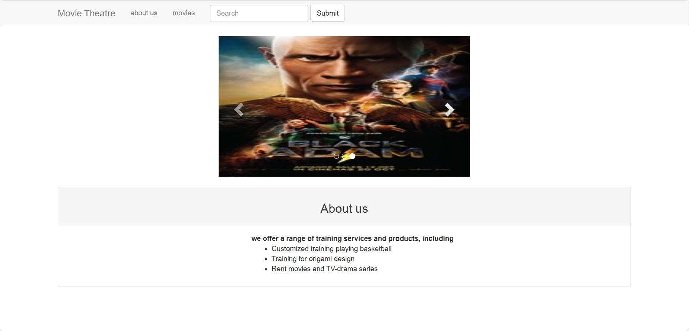
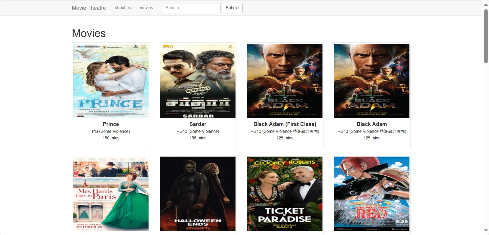
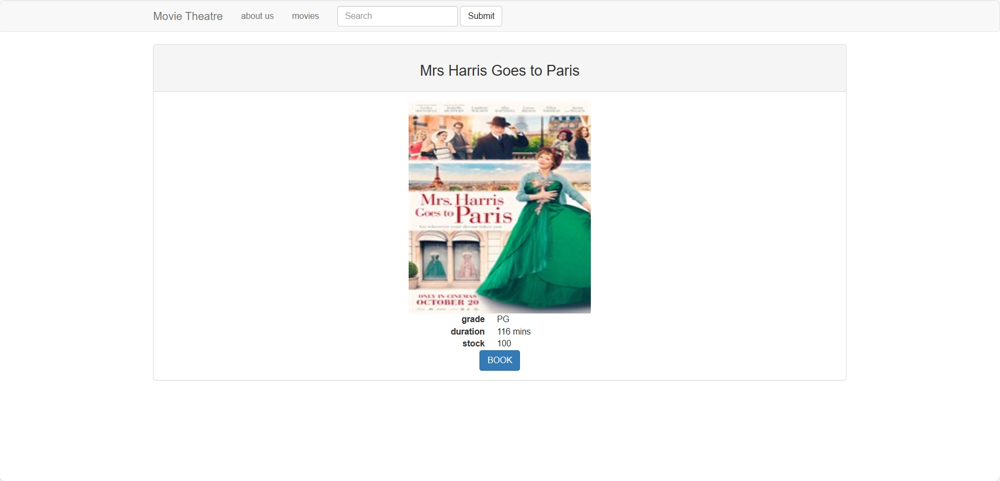

# Movie Theatre Website

#### Description

The movie theatre website is designed to display movie menu and movie detail information, and provide booking service.

#### Framework

The backend framework of the project is Django. The frontend framework is Bootstrap, which provides a set of pre-designed HTML, CSS, and JavaScript components. The database is sqlite.

#### Website display
The following is some pages of the website.

###### Introduction page

###### Movie Menu

###### Movie detail

